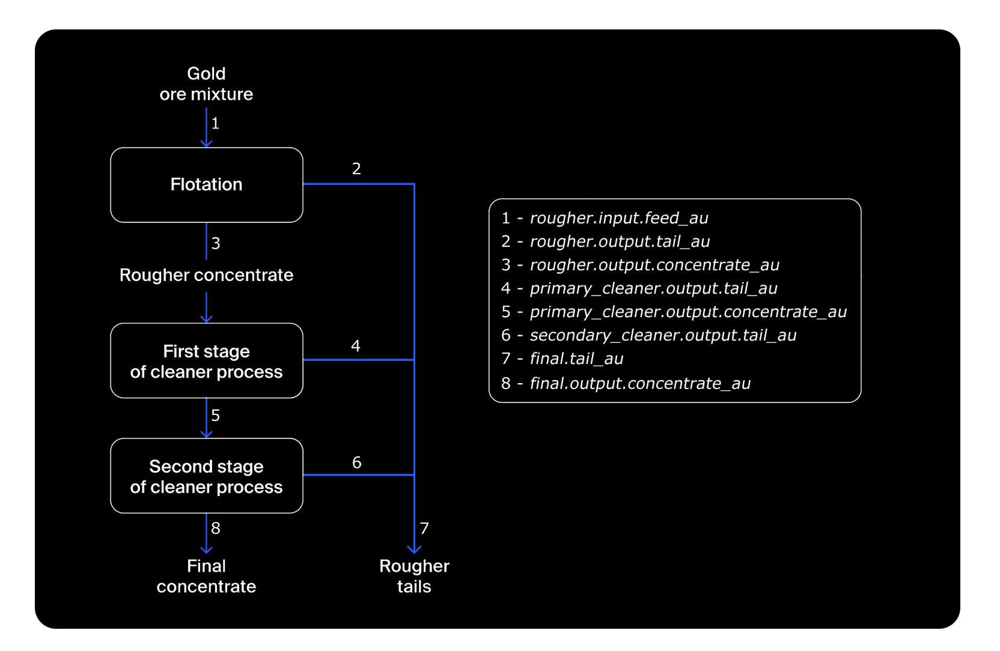
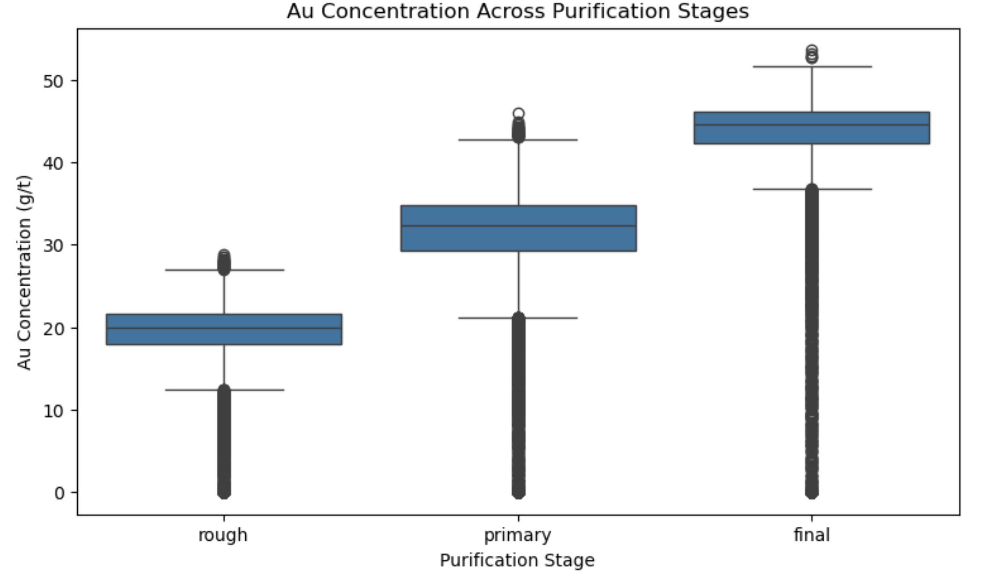
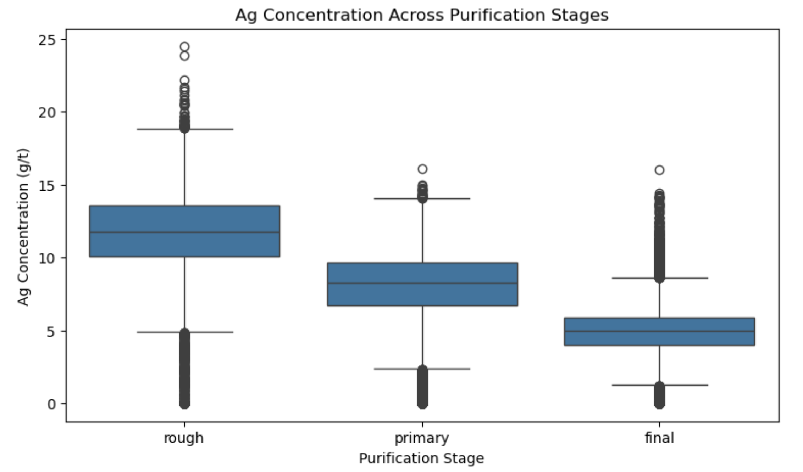
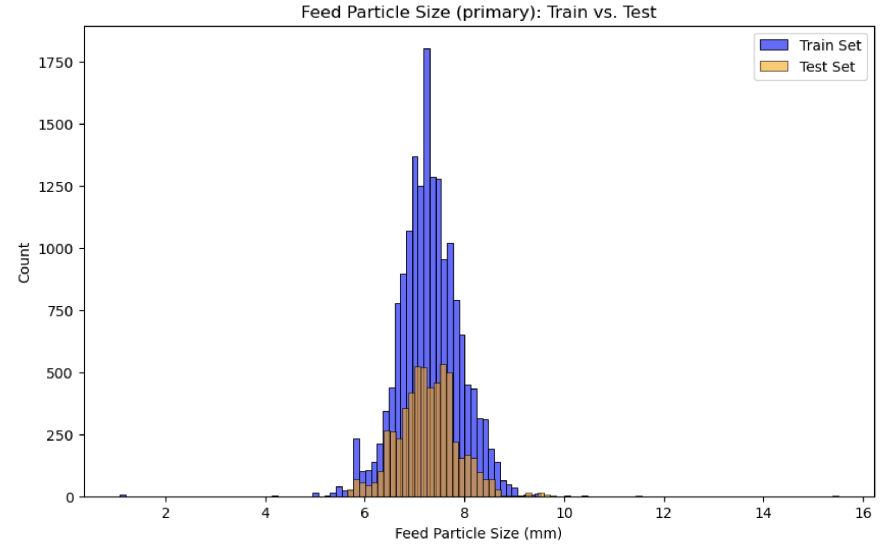

# ⛏️ Gold Recovery Prediction

**Optimizing industrial yield for Zyfra by predicting gold recovery efficiency.**

---

## 📋 Overview

This project delivers a machine learning solution for **Zyfra**, a company specializing in efficiency solutions for heavy industry. The primary objective is to predict the amount of gold recovered from gold ore to enhance production yields. By accurately forecasting the recovery rate, the company can optimize the extraction process and avoid running operations with unprofitable parameter settings.

The workflow involves **processing time-indexed sensor data**, simulating the entire purification process from rougher feed to final concentrate.

---

## 🎯 Objectives

* **Data Integrity:** Validate the correctness of recovery calculations in the raw data and preprocess time-indexed datasets.
* **Process Analysis:** Track the changing concentrations of metals (Gold, Silver, Lead) across sequential purification stages.
* **Distribution Check:** Compare particle size distributions in training vs. test sets to ensure model generalizability.
* **Model Development:** Train regressors to predict two distinct target variables: `rougher.output.recovery` and `final.output.recovery`.
* **Evaluation:** Implement a custom **sMAPE (Symmetric Mean Absolute Percentage Error)** metric to evaluate model accuracy.

---

## 💾 Data Description

The data is indexed by the date and time of acquisition (`date`). Parameters observed close in time are often similar.

| Dataset | Description |
| :--- | :--- |
| **`gold_recovery_train.csv`** | Training data containing features and both target variables. |
| **`gold_recovery_test.csv`** | Test data without target variables (used for final evaluation). Some features calculated later in the process are absent here. |
| **`gold_recovery_full.csv`** | The complete raw dataset containing all features and targets. |

---

## ⚙️ The Purification Process

Understanding the industrial process was critical for feature selection. The ore passes through distinct stages:

1.  **Flotation (Rougher):** Gold ore mixture is fed into float banks to produce a rougher Au concentrate.
2.  **Primary Cleaner:** The product undergoes primary purification.
3.  **Secondary Cleaner:** Further purification to remove impurities.
4.  **Final Concentrate:** The final output containing the highest gold concentration.

---

## 🔬 Modeling & Performance

To solve this regression task, I evaluated **Linear Regression**, **Decision Tree**, and **Random Forest** models. A key challenge was defining the custom loss function, **sMAPE**, which is standard in this industrial domain for measuring accuracy in percentage terms.

The final sMAPE is calculated as a weighted average of the rougher stage (25%) and the final stage (75%).

| Model | Final sMAPE Score | Verdict |
| :--- | :--- | :--- |
| **Random Forest** | **7.08** | **🏆 Best Model** |
| Linear Regression | *High sMAPE* | Outperformed |
| Decision Tree | *High sMAPE* | Outperformed |

**Insight:** The **Random Forest Regression** model significantly outperformed the other algorithms, achieving the lowest error rate (7.08 sMAPE), making it the most reliable choice for predicting recovery efficiency.

---

## 🖼️ Key Visualizations

The EDA phase revealed crucial insights into the chemical process, confirming the data's validity for modeling.

| **Gold (Au) Concentration** | **Silver (Ag) Concentration** |
|:---:|:---:|
|  |  |
| *Gold concentration consistently increases at every stage, peaking at the final output.* | *Silver levels decrease as purification progresses, indicating successful removal of impurities.* |

### Particle Size Distribution
To ensure the model trained on historical data would work on new data, I compared the feed particle size distributions.

*The overlapping distributions confirm that the training and test sets are representative of each other.*

---

## 📝 Conclusion

By rigorously cleaning the data, validating the chemical process trends, and optimizing a Random Forest Regressor, I achieved a **Final sMAPE of 7.08**. This model provides Zyfra with a reliable tool to predict gold recovery, enabling data-driven decisions to optimize production settings and maximize profitability.